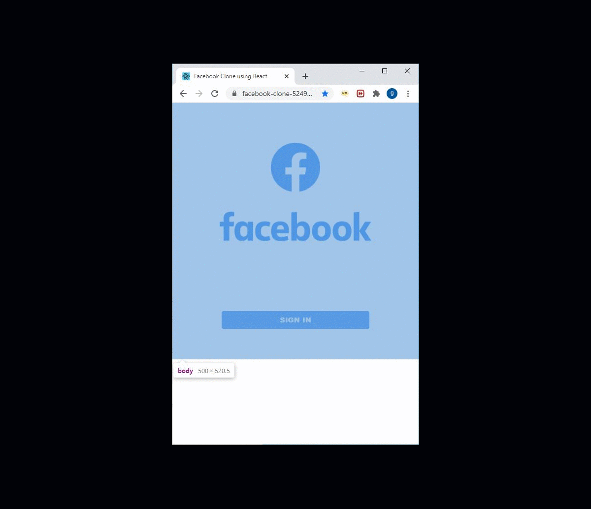

# FACEBOOK CLONE

## Project Description

The objective of this project is to build a minimal responsive facebook clone version come with the following features:

- Register new account
- User authentication with Google account
- Writing posts and comments (text & image)
- Liking posts and comments
- Sending / accepting / canceling friend requests
- Notifications for new friend request.

## 🖼️ Screenshot

## 🌐 [Live Preview](https://facebook-clone-52490.firebaseapp.com/)

## 🛠️ Tech stack

In this project we used:

- React 16.3.1
- HTML5 and CSS3
- MaterialUI
- Firebase

## 🧾 TODO

- Liking posts and comments
- Sending / accepting / canceling friend requests
- Notifications for new friend request.

## 🤝 Contributing

Contributions, issues and feature requests are welcome!

Feel free to check the [issues page](../../issues).

## ⭐️ Show your support

Give a ⭐️ if you like this project!

## 👨🏽‍💻 Authors

- [@goffxnca](https://github.com/goffxnca/)

## 📝 License

[MIT licensed](./LICENSE).
